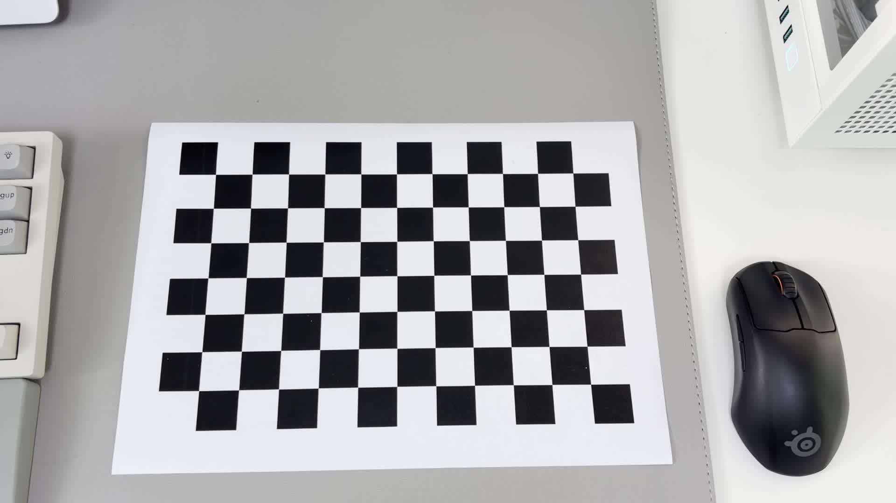
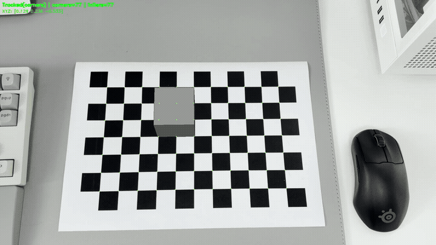
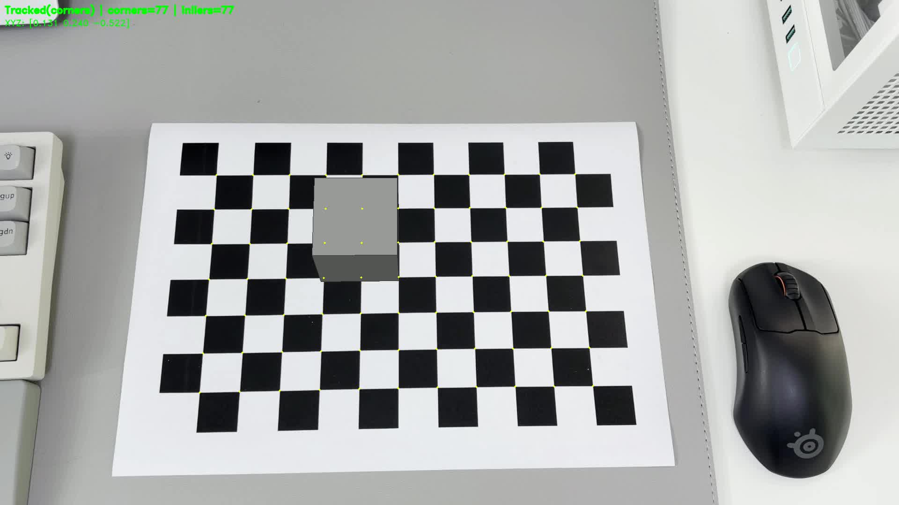
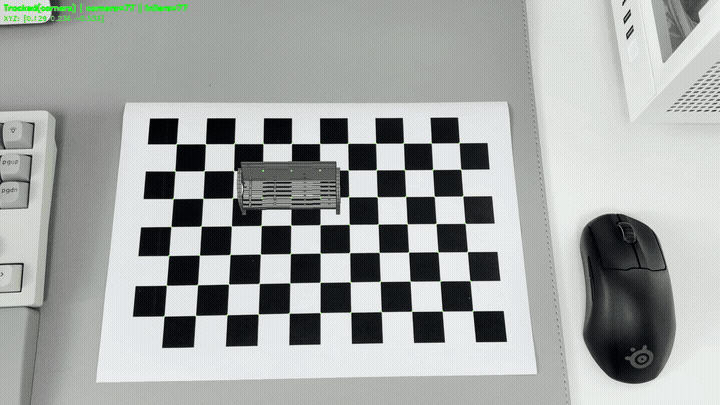

# AR Camera Pose Estimation and 3D Rendering

OpenCV와 NumPy만으로 다음 파이프라인을 통합 구현한 프로젝트입니다.

- 카메라 캘리브레이션
- 왜곡 보정(이미지/영상/실시간)
- 체스보드 기반 카메라 포즈 추정
- OBJ 기반 3D AR 렌더링(와이어프레임/솔리드)
- 추적 안정화(Optical Flow fallback, pose smoothing, jump rejection)

본 문서는 실제 워크스페이스 구조와 현재 실행 가능한 스크립트를 기준으로 작성되었습니다.

## 데모 미리보기

> **Tip:** 아래의 썸네일(GIF)이나 **풀영상** 링크를 클릭하면 GitHub의 비디오 플레이어로 원본 영상을 시청할 수 있습니다.

### 입력 원본 영상

원본 프레임:

풀영상 재생:

**[입력 원본 풀영상](https://github.com/todayoneul/AR_Camera_Pose_Estimation_and_3D_Rendering/raw/main/media/input/IMG_0230.MOV)**

### Cube AR 데모

정지 프레임:

풀영상 재생:

**[Cube AR 풀영상](https://github.com/todayoneul/AR_Camera_Pose_Estimation_and_3D_Rendering/raw/main/media/output/cube.mp4)**

### Public Bench (Public Chair) AR 데모

정지 프레임:

풀영상 재생:

**[Public Bench AR 풀영상](https://github.com/todayoneul/AR_Camera_Pose_Estimation_and_3D_Rendering/raw/main/media/output/publicBench.mp4)**

### 추가 데모

비교 영상 재생:

**[비교 테스트 풀영상](https://github.com/todayoneul/AR_Camera_Pose_Estimation_and_3D_Rendering/raw/main/media/output/compare_test.mp4)**

안정화 테스트 영상 재생:

**[안정화 테스트 풀영상](https://github.com/todayoneul/AR_Camera_Pose_Estimation_and_3D_Rendering/raw/main/media/output/final_test_noblock.mp4)**

## 프로젝트 구조

~~~text
calibration_and_AR/
├─ pose_estimation_chessboard.py      # 체스보드 기반 AR 메인 파이프라인
├─ camera_calibration.py              # 카메라 캘리브레이션
├─ distortion_correction.py           # 왜곡 보정(이미지/영상/실시간)
├─ calibration_result.json            # 캘리브레이션 결과(JSON)
├─ assets/
│  └─ models/
│     ├─ cube.obj                     # 경량 데모 모델
│     └─ publicBench.obj              # 벤치(의자) 데모 모델
├─ media/
│  ├─ input/
│  │  ├─ IMG_0229.MOV
│  │  └─ IMG_0230.MOV
│  ├─ output/
│  │  ├─ cube.mp4
│  │  ├─ publicBench.mp4
│  │  ├─ compare_test.mp4
│  │  └─ final_test_noblock.mp4
│  └─ previews/
│     ├─ original_preview.gif
│     ├─ cube_preview.gif
│     ├─ publicbench_preview.gif
│     ├─ original_frame.jpg
│     ├─ cube_frame.jpg
│     └─ publicbench_frame.jpg
└─ README.md
~~~

## 빠른 시작

### 1) 환경 준비

~~~bash
source .venv/bin/activate
pip install -r requirements_pose_ar.txt
~~~

### 2) Cube AR 렌더링

~~~bash
python pose_estimation_chessboard.py \
  --input media/input/IMG_0230.MOV \
  --calibration calibration_result.json \
  --board-size 11,7 \
  --square-size 0.024 \
  --box-origin 4,2 \
  --obj assets/models/cube.obj \
  --obj-scale 0.05 \
  --solid \
  --output media/output/cube.mp4
~~~

### 3) Public Bench AR 렌더링

~~~bash
python pose_estimation_chessboard.py \
  --input media/input/IMG_0230.MOV \
  --calibration calibration_result.json \
  --board-size 11,7 \
  --square-size 0.024 \
  --box-origin 4,2 \
  --obj assets/models/publicBench.obj \
  --obj-scale 0.05 \
  --obj-rx -90 \
  --flip-x \
  --solid \
  --output media/output/publicBench.mp4
~~~

## 구현된 기능

### 1) 체스보드 기반 포즈 추정

- `cv2.findChessboardCorners` / `cv2.cornerSubPix`로 2D 코너를 정밀 검출
- 체스보드 월드 좌표와 2D 좌표를 대응시켜 `cv2.solvePnP`로 포즈 추정
- 평면 패턴에서 발생하는 자세 뒤집힘 완화를 위해 Iterative 방식 사용

### 2) 추적 안정화 파이프라인

- 코너 검출 실패 시 `cv2.calcOpticalFlowPyrLK` 기반 fallback 추적
- Forward-Backward 에러 임계값(`--flow-fb-thresh`)으로 추적 품질 필터링
- 프레임 간 포즈 점프 제한
  - 회전 점프 제한: `--max-angle-jump`
  - 이동 점프 제한: `--max-trans-jump`
- 일시 유실 시 마지막 포즈 유지: `--hold-frames`
- 포즈 스무딩: 회전 행렬 SVD 기반 보간(`--pose-smooth`)

### 3) OBJ 파서 및 좌표계 보정

- OBJ의 `v`, `f` 레코드 직접 파싱
- 모델 전처리 옵션
  - 스케일: `--obj-scale`
  - 회전: `--obj-rx`, `--obj-ry`, `--obj-rz`
  - 축 반전: `--flip-x`, `--flip-y`, `--flip-z`
- 모델링 툴마다 다른 좌표계(Y-up/Z-up) 차이를 런타임에서 보정

### 4) OpenCV 기반 소프트웨어 렌더링

- 3D 정점 투영: `cv2.projectPoints`
- 와이어프레임 모드: `cv2.polylines`
- 솔리드 모드(`--solid`)
  - 깊이 정렬(Painter's Algorithm)
  - 법선 벡터 기반 단순 난반사 조명(ambient + diffuse)
  - `cv2.fillPoly`로 면 채우기

## 핵심 기술 설명

### 캘리브레이션

- 표준 모델과 fisheye 모델을 모두 지원
- 추정 결과(JSON)에 다음 포함
  - 카메라 행렬(camera matrix)
  - 왜곡 계수(distortion coefficients)
  - RMSE 재투영 오차
  - 사용된 샘플 수 및 이미지 크기

### 왜곡 보정

- 영상/이미지 보정과 실시간 미리보기 지원
- 보정 강도 미세 제어: `--strength`
- 유효 영역 기반 크롭 제어: `--crop`, `--no-crop`
- 비교 영상/비교 프레임 자동 생성

### 포즈 추정 및 AR

- 체스보드 코너 기반 카메라 포즈 추정
- 객체 좌표계 변환과 모델 배치
- 렌더링 모드(선/면) 선택
- 추적 실패 복구 및 프레임 안정화

## 스크립트별 사용법

### 1) camera_calibration.py

입력은 영상 파일, 이미지 폴더, 카메라 인덱스 중 하나를 받을 수 있습니다.

~~~bash
# 카메라 목록 조회
python camera_calibration.py --list-cameras

# 영상으로 캘리브레이션
python camera_calibration.py media/input/IMG_0230.MOV \
  --board-size 11,7 \
  --square-size 24.0 \
  --frame-interval 15 \
  --output calibration_result.json

# 웹캠으로 캘리브레이션 샘플 수집
python camera_calibration.py 0 \
  --board-size 11,7 \
  --square-size 24.0 \
  --frame-interval 15 \
  --max-samples 30 \
  --output calibration_result.json
~~~

### 2) distortion_correction.py

~~~bash
# 영상 왜곡 보정
python distortion_correction.py calibration_result.json \
  --input media/input/IMG_0230.MOV \
  --output media/output \
  --alpha 0.6 \
  --strength 0.92

# 이미지 왜곡 보정
python distortion_correction.py calibration_result.json \
  --input sample.jpg \
  --output media/output

# 실시간 미리보기
python distortion_correction.py calibration_result.json --live --camera 0
~~~

### 3) pose_estimation_chessboard.py

~~~bash
python pose_estimation_chessboard.py \
  --input media/input/IMG_0230.MOV \
  --calibration calibration_result.json \
  --board-size 11,7 \
  --square-size 0.024 \
  --box-origin 4,2 \
  --obj assets/models/publicBench.obj \
  --obj-scale 0.05 \
  --obj-rx -90 \
  --flip-x \
  --solid \
  --compare-view \
  --output media/output/compare_test.mp4
~~~

## 주요 CLI 옵션 요약 (pose_estimation_chessboard.py)

- 입력/출력
  - `--input`: 입력 영상 경로 또는 카메라 인덱스
  - `--output`: 출력 영상 경로
  - `--compare-view`: 원본과 AR 결과를 좌우 병합 저장/표시
- 체스보드/스케일
  - `--board-size`: 내부 코너 개수(예: 11,7)
  - `--square-size`: 체스보드 한 칸의 실제 크기(미터)
  - `--box-origin`, `--box-size`: 기본 박스 기준 위치/크기
- OBJ 렌더링
  - `--obj`: OBJ 파일 경로
  - `--obj-scale`: 객체 스케일
  - `--obj-rx`, `--obj-ry`, `--obj-rz`: 축 회전
  - `--flip-x`, `--flip-y`, `--flip-z`: 축 반전
  - `--solid`: 솔리드 렌더링
- 안정화
  - `--pose-smooth`: 포즈 스무딩 비율
  - `--min-track-corners`: fallback 추적 최소 코너 수
  - `--flow-fb-thresh`: Optical Flow FB 오차 임계값
  - `--hold-frames`: 추적 유실 후 포즈 유지 프레임 수
  - `--max-angle-jump`, `--max-trans-jump`: 급격한 포즈 변화 차단

## 현재 캘리브레이션 결과 상세

기준 파일: [calibration_result.json](calibration_result.json)

### 1) 품질 요약

| 항목 | 값 |
|---|---:|
| 모델 | standard |
| 이미지 크기 | 1920 x 1080 |
| 사용 샘플 수 | 217 |
| RMSE (재투영 오차) | 0.1650 px |
| fx | 1800.7681 |
| fy | 1807.9475 |
| cx | 959.5 |
| cy | 539.5 |

### 2) Camera Matrix

~~~text
[[1800.7681,    0.0000, 959.5000],
 [   0.0000, 1807.9475, 539.5000],
 [   0.0000,    0.0000,   1.0000]]
~~~

### 3) Distortion Coefficients

| 계수 | 값 |
|---|---:|
| k1 | -1.355873 |
| k2 | 45.799307 |
| p1 | -0.002239 |
| p2 | 0.002372 |
| k3 | -255.381096 |
| k4 | -1.576495 |
| k5 | 46.319116 |
| k6 | -253.491594 |

설명: 캘리브레이션 코드에서 Rational Model을 사용하므로 k4~k6까지 추정됩니다.

### 4) 오토포커스(초점 고정 없음) 환경에서 오차를 억제한 방법

본 실험은 iPhone 자동초점 상태에서 진행되었고, 초점 거리 변화로 인한 미세한 내부 파라미터 변동 가능성이 존재합니다. 이를 완화하기 위해 아래 전략을 적용했습니다.

1. 캘리브레이션 단계에서 프레임 간격 샘플링(`--frame-interval`)으로 유사 프레임 중복을 줄이고, 다양한 거리/각도의 체스보드 포즈를 충분히 수집했습니다.
2. 코너 검출 후 `cv2.cornerSubPix`로 서브픽셀 정밀화를 적용해 코너 오차를 줄였습니다.
3. 캘리브레이션 시 표준 + Rational Model(왜곡 고차항 포함)을 사용하여 왜곡 파라미터 적합도를 높였습니다.
4. 왜곡 보정 단계에서 `--strength`를 제공해 과보정이 보일 때 강도를 완화할 수 있게 했습니다.
5. AR 추정 단계에서 포즈 점프 제한(`--max-angle-jump`, `--max-trans-jump`)과 스무딩(`--pose-smooth`)을 함께 적용해 오토포커스 변화에 따른 순간적인 포즈 튐을 억제했습니다.

### 5) 체커보드가 일부 잘렸을 때 AR 모델을 유지한 방법

전체 체커보드가 보이지 않아 코너 재검출이 실패하는 프레임에서도 AR 모델이 갑자기 사라지지 않도록 아래 복구 체인을 구현했습니다.

1. 직전 프레임 코너를 `cv2.calcOpticalFlowPyrLK`로 추적하여 임시 관측치를 생성합니다.
2. Forward-Backward 오차(`--flow-fb-thresh`)를 적용해 오추적 점을 제거합니다.
3. 유효 점 개수가 임계치(`--min-track-corners`) 이상이면 해당 점만으로 다시 solvePnP를 수행합니다.
4. 그래도 추정이 불안정하면 마지막 정상 포즈를 `--hold-frames` 동안 유지하여 시각적 끊김을 줄입니다.
5. 복구된 포즈가 비정상적으로 튀면 jump rejection으로 폐기하고 직전 안정 포즈를 유지합니다.

실전 권장값 예시:

~~~bash
python pose_estimation_chessboard.py \
  --input media/input/IMG_0230.MOV \
  --calibration calibration_result.json \
  --board-size 11,7 \
  --square-size 0.024 \
  --box-origin 4,2 \
  --obj assets/models/publicBench.obj \
  --obj-scale 0.05 \
  --obj-rx -90 \
  --flip-x \
  --solid \
  --min-track-corners 16 \
  --flow-fb-thresh 1.5 \
  --pose-smooth 0.12 \
  --hold-frames 12 \
  --max-angle-jump 35 \
  --max-trans-jump 0.35 \
  --output media/output/publicBench.mp4
~~~

## 성능 및 한계

- `--solid` + 고폴리곤 OBJ는 CPU 렌더링 특성상 프레임 저하가 발생할 수 있습니다.
- 실시간성이 중요하면 다음을 권장합니다.
  - 저폴리곤 모델 사용
  - 와이어프레임 모드 사용( `--solid` 미사용)
  - 출력 해상도/프레임 조건 완화
- 현재 렌더링은 OpenCV 기반 소프트웨어 파이프라인이므로 PBR/텍스처 매핑 엔진 수준 결과를 제공하지 않습니다.

## 트러블슈팅

- 객체가 바닥 아래로 들어감: `--flip-z` 시도
- 좌우 반전됨: `--flip-x` 시도
- 상하 반전됨: `--flip-y` 시도
- 객체가 누워 보임: `--obj-rx`, `--obj-ry`, `--obj-rz` 조합 조정
- 렉이 심함: 저폴리곤 모델 사용 또는 `--solid` 제거
- 체스보드 인식 불안정: 조명 확보, 보드 크기/칸 크기 파라미터 확인, `--use-sb` 시도

## 라이선스 및 참고

- OpenCV 문서: https://docs.opencv.org/
